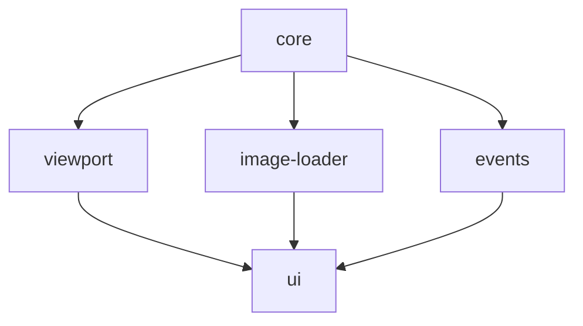

# OpenDicom

> Modular, open-source DICOM viewer web application built with TypeScript and Cornerstone.js

[](https://github.com/opendicom/dicom-viewer/actions)
[](https://codecov.io/gh/opendicom/dicom-viewer)

## 🏥 Overview

OpenDicom is a comprehensive, modular DICOM viewer designed for medical professionals and developers. Built with modern web technologies, it provides a robust foundation for medical imaging applications.

### ✨ Key Features

- **Modular Architecture**: 16 independent NPM packages for maximum flexibility
- **TypeScript First**: Full type safety and excellent developer experience
- **Medical Grade**: Optimized for medical imaging workflows
- **Modern Stack**: Next.js, Tailwind CSS, shadcn/ui components
- **Cornerstone.js Integration**: Powerful medical imaging rendering
- **Zustand State Management**: Lightweight and performant

## 📦 Packages

| Package | Description | Version |
|---------|-------------|----------|
| [@opendicom/core](./packages/core) | Core functionality and utilities |  |
| [@opendicom/viewport](./packages/viewport) | Viewport management and rendering |  |
| [@opendicom/image-loader](./packages/image-loader) | DICOM image loading and caching |  |
| [@opendicom/events](./packages/events) | Event system and handling |  |
| [@opendicom/ui](./packages/ui) | UI components and themes |  |

## 🚀 Quick Start

### Prerequisites

- Node.js >= 18.0.0
- npm >= 8.0.0

### Installation

```bash
# Clone the repository
git clone https://github.com/opendicom/dicom-viewer.git
cd dicom-viewer

# Install dependencies
npm install

# Bootstrap packages
npm run bootstrap

# Build all packages
npm run build
```

### Development

```bash
# Start development mode (watches all packages)
npm run dev

# Run tests
npm run test

# Lint code
npm run lint
```

## 🏗️ Architecture

```
open-dicom/
├── packages/           # Independent NPM packages
│   ├── core/          # Core functionality
│   ├── viewport/      # Viewport management
│   ├── image-loader/  # Image loading
│   ├── events/        # Event system
│   └── ui/           # UI components
├── tools/            # Build and development tools
├── docs/             # Documentation
└── .github/          # CI/CD workflows
```

### Package Dependencies



## 🛠️ Development

### Adding a New Package

```bash
# Create new package
npx lerna create @opendicom/new-package

# Add dependencies
npx lerna add dependency-name --scope=@opendicom/new-package

# Link packages
npm run bootstrap
```

### Publishing

```bash
# Version packages (interactive)
npm run version

# Publish to npm
npm run publish
```

### Conventional Commits

This project follows [Conventional Commits](https://www.conventionalcommits.org/) specification:

```
feat(core): add DICOM metadata extraction
fix(viewport): resolve rendering issue with large images
docs(readme): update installation instructions
medical(core): implement HU value calculations
```

#### Commit Types

- `feat`: New features
- `fix`: Bug fixes
- `docs`: Documentation changes
- `style`: Code style changes
- `refactor`: Code refactoring
- `perf`: Performance improvements
- `test`: Test additions/modifications
- `build`: Build system changes
- `ci`: CI/CD changes
- `chore`: Maintenance tasks
- `medical`: Medical imaging specific changes

## 🧪 Testing

```bash
# Run all tests
npm run test

# Run tests for specific package
npx lerna run test --scope=@opendicom/core

# Run tests in watch mode
npm run test -- --watch
```

## 📋 Scripts

| Script | Description |
|--------|-------------|
| `npm run build` | Build all packages |
| `npm run test` | Run all tests |
| `npm run lint` | Lint all packages |
| `npm run clean` | Clean build artifacts |
| `npm run bootstrap` | Link package dependencies |
| `npm run dev` | Start development mode |
| `npm run version` | Version packages |
| `npm run publish` | Publish packages |

## 🤝 Contributing

1. Fork the repository
2. Create a feature branch: `git checkout -b feat/amazing-feature`
3. Make your changes following our coding standards
4. Add tests for your changes
5. Commit using conventional commits: `git commit -m 'feat(core): add amazing feature'`
6. Push to your branch: `git push origin feat/amazing-feature`
7. Open a Pull Request

### Code Style

- TypeScript with strict mode
- ESLint with medical imaging specific rules
- Prettier for code formatting
- 80 character line limit
- Comprehensive JSDoc comments

## Acknowledgments

- [Cornerstone.js](https://cornerstonejs.org/) - Medical imaging rendering
- [dcmjs](https://github.com/dcmjs-org/dcmjs) - DICOM parsing
- [Lerna](https://lerna.js.org/) - Monorepo management

## 📞 Support

- 📧 Email: rogulraj@gmail.com
---

**Made with ❤️ for the medical imaging community**